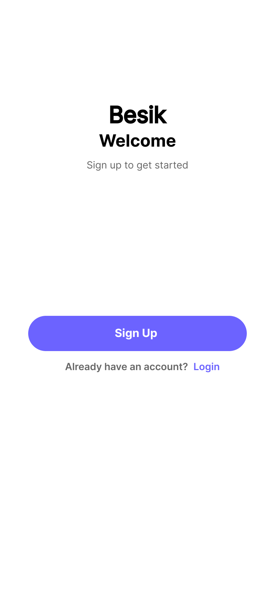
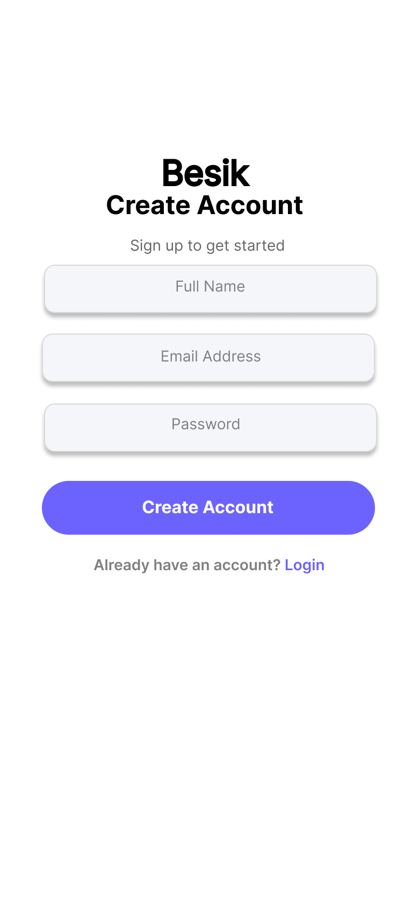
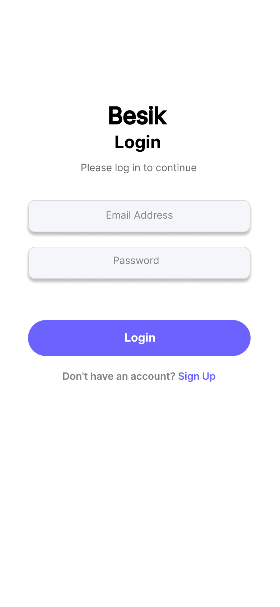

# Task 1: Mobile App Signup Flow

## Objective
Design a simple and user-friendly mobile signup flow that allows users to create an account and log in easily.

## Tools Used
- Figma

## Screens Designed
1. Welcome Screen – Introduces the app and directs user to signup
2. Create Account Screen – Collects basic user information (Name, Email, Password)
3. Login Screen – Allows existing users to log into the app

## Design Principles Followed
- Minimal input fields (only necessary information)
- Clear navigation between signup and login
- Consistent layout and spacing
- Readable typography and accessible button placement

## Screenshots

