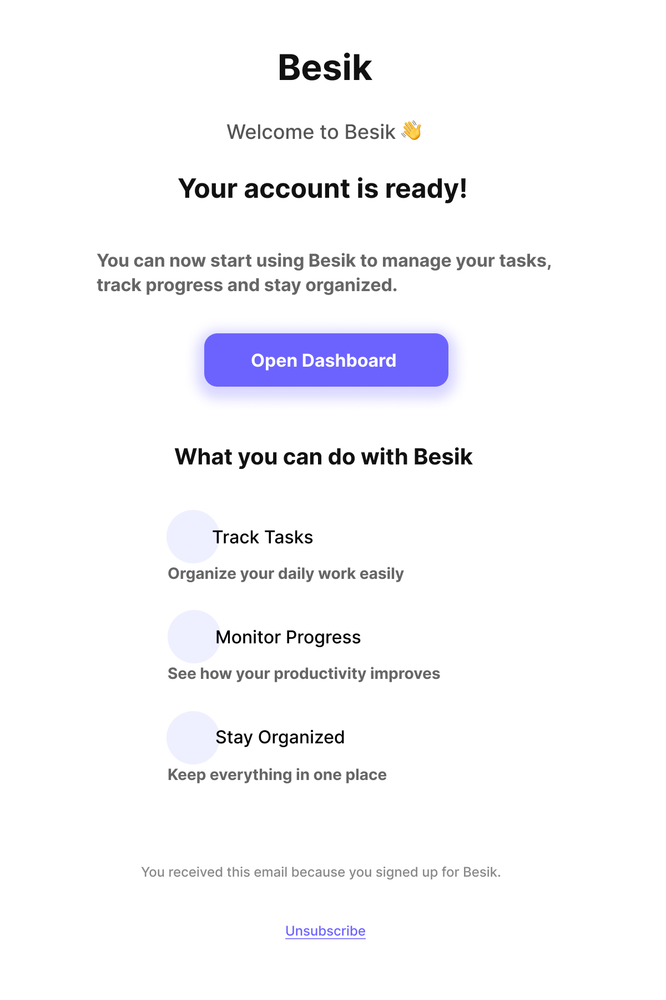

# Task 2: Email Template Design

## Objective
Design a clean and responsive email template for user engagement.

## Tool Used
Figma

## Description
A welcome email template for the Besik app.  
The email informs users that their account is ready and guides them to the dashboard.

## Features
- Clear heading and message
- Call-to-action button
- Feature highlights
- Footer with unsubscribe option

## Screenshot

