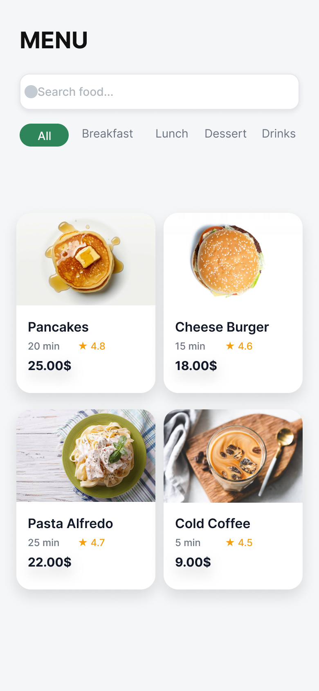
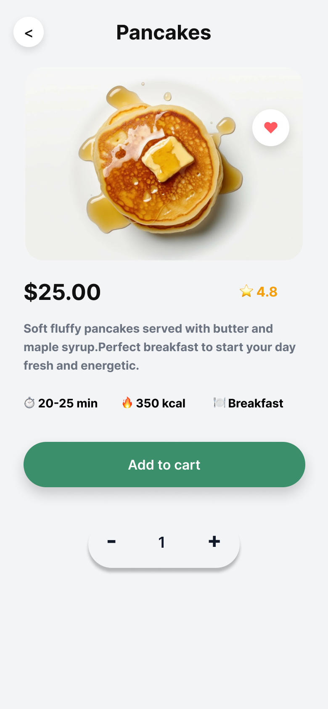

# Task 3 — Restaurant Menu UI

## Objective
Design a restaurant menu interface that is visually appealing, categorized and easy to use.

## Features
- Food category tabs
- Food cards with image, rating and price
- Food details screen
- Add to cart section
- Interactive navigation between screens

## Tool Used
Figma

## Screens

### Menu Screen

### Food Details Screen

